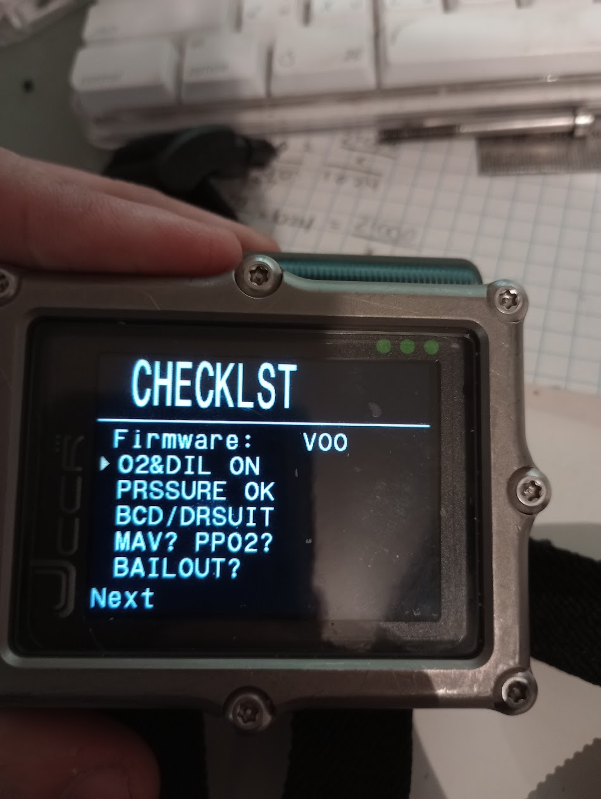
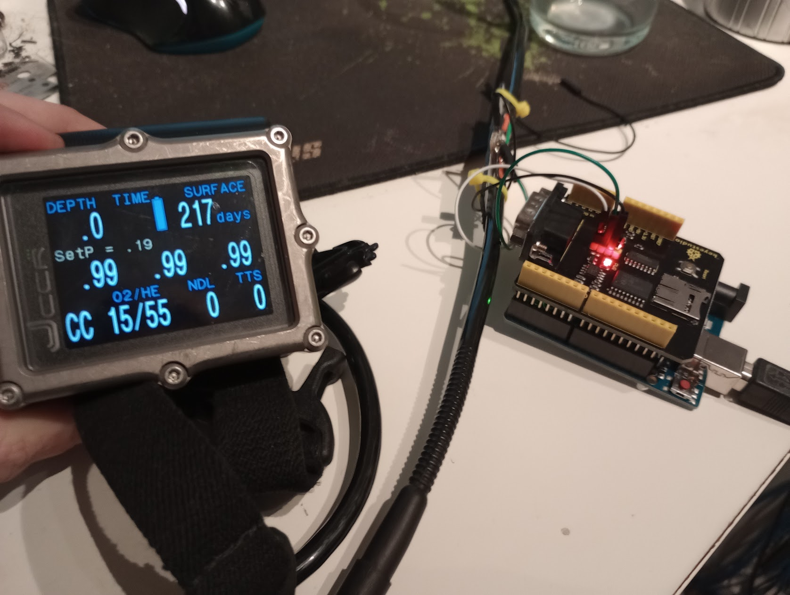

This is a simple demo program that acts as a DiveCAN solenoid board from a JJ CCR. Note that this code was written as a demo/testing environment for DiveCAN messaging, it is not designed for diving use.

What works:
- PPO2 transmission
- Millivolt transmission
- ID/Name/Version transmission
- Successful calibration
- Bus Device menu text items.
- Cell voting/masking
- Consensus PPO2 value.

What doesn't:
- Failed calibrations
- Incremental calibration updates
- Editable menu items
- Error states
- Serial number transmission

# Software prerequisites
This demo was made in the Arduino IDE and makes use of the [mcp_can](https://github.com/coryjfowler/MCP_CAN_lib/tree/master) library to send and receive data on the bus. Ensure the Arduino is configured to use a 16MHz clock.

# Hardware prerequisites
This demo runs on an Arduino Uno with the [CAN shield](https://www.keyestudio.com/2019new-keyestudio-can-bus-shield-mcp2551-chip-with-sd-socket-for-arduino-uno-r3-p0543.html). The GND, CANLow, and CANHigh header pins on the shield are wired to the corresponding Ground, CanLow, and CANHigh pins of the DiveCAN connector (see `Hardware/` for more details about connector pinout).

# Checklist embedded in Bus Devices Menu

# Error Free PPO2 display
