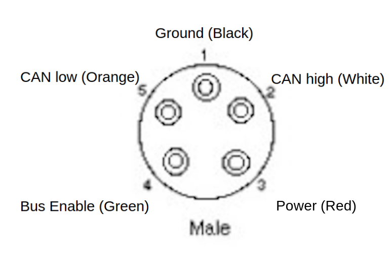

# Power
The Power pin is very general purpose and the voltage on this pin depends on the unit hosting the DiveCAN bus. On the rEvo this pin is held at 9v, supplied by the 9v battery in the battery box. On a JJ this pin is at 3.3v, being provided by the computer in the case of the control bus and by a SAFT primary lithium cell for the monitor bus. The current that can be continuously drawn from the Shearwater computer power supply over the DiveCAN bus is ~16 mA (as tested on a JJ Petrel 2 and JJ Petrel 3), this power is available even when the computer is turned off.

# Bus Enable 
This pin is pulled through a high resistance (2 megaohm on the rEvo battery box) to the power pin by all nodes on bus. While this pin is at a high voltage, all the nodes are in a low power/standby state. When this pin is pulled down to ground (typically by the dive computer) all nodes on the network activate and begin transmitting on the DiveCAN bus.

# CAN Low/CAN High
CAN bus differential pair, runs at a reduced voltage (3.0v CAN high, 2.0v CAN idle, 0.0v CAN low, sampled from a rEvo battery box) compared to standard CAN, however is tolerant of standard voltage levels. DiveCAN uses a 560 ohm resistor on each terminating device.

# Connector
The connector is an AK/Subconn style wet connect, however the size/model has not been identified. It is smaller than the "miniature" size, with an 11mm OD on the connector.

